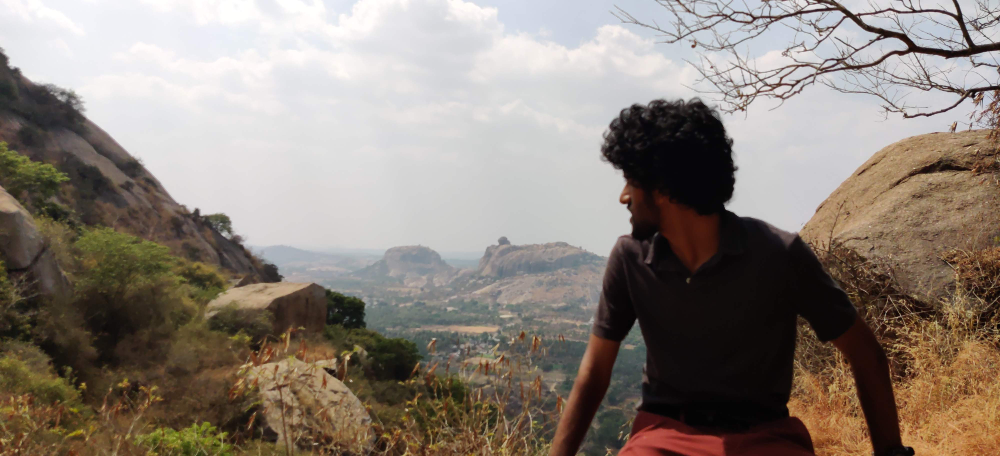
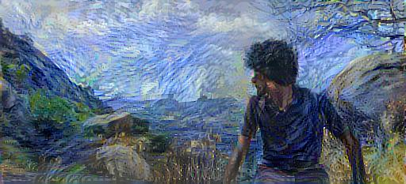

# Style-Transfer-Tensorflow







***Some information of the code*** :

* We use the VGG19 network architecture, a pretrained image classification network, for obtaining feature maps that we use in style transfer.
* For Content we use 'block5_conv2' layer and for Style, we use 'block1_conv1','block2_conv1','block3_conv1', 'block4_conv1', 'block5_conv1'.
* Adam optimiser for Gradient Descent.

For more information on how style transfer works along with the code, check out my blog [here]()


## Running

***Recommended to use an environment***

I am using Python version 3.7


1. Clone the repository

2. Install the requirements at Data/requirements.txt

    ```
    pip install -r requirements.txt
    ```


3. Train and sample!

```
cd Code
python3 main.py
```

optional arguments:


  CONTENT_PATH : -cp, --content_path : Content file path. Default='../Data/Content/waves.jpg'

  STYLE_PATH : -sp, --style_path : Style file path. Default='../Data/Styles/wave.jpg'

  OUTPUT_PATH : -op, --output_path : Output file path. Default='../Data/Content/1.jpg'

  CONTENT_PATH_LAYER : -cpl, --content_path_layer : Content text file with layer name. Default='../Data/Layers/content.txt'

  STYLE_PATH_LAYERS : -spl, --style_path_layers : Style text file with layer names. Default='../Data/Layers/style.txt'

  STYLE_WEIGHT : -sw, --style_weight : Style weights. Default=1e-2

  CONTENT_WEIGHT : -cw, --content_weight : Content weights. Default=1e4

  TOTAL_VARIATION_WEIGHT : -tw, --total_variation_weight : Total Variation weight. Default=30

  LEARNING_RATE : -lr, --learning_rate : Learning Rate in Adam. Default=0.02

  BETA : -b BETA_1, --beta1 BETA_1 : Beta in Adam. Default=0.99

  EPOCH : -e EPOCHS, --epochs EPOCHS : Epochs. Default=10

  STEPS_PER_EPOCH : -spe, --steps_per_epoch : Steps per epoch. Default=100
  
